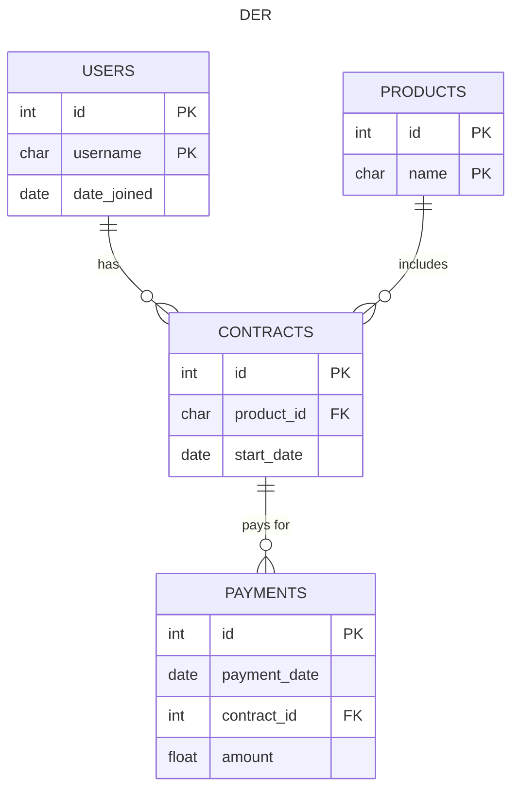
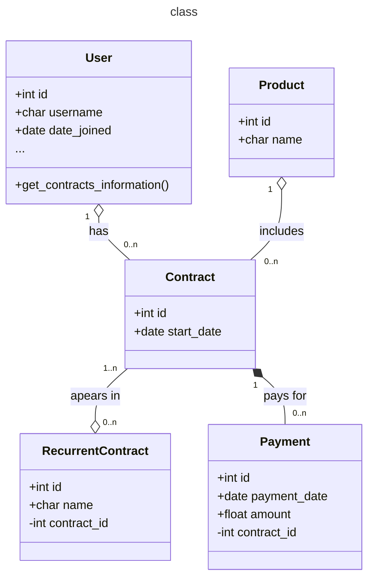

1. Given the following SQL tables

| **Payments** |           |
| ------------ | --------- |
| Id           | Integer   |
| payment_date | Timestamp |
| contract_id  | Integer   |
| amount       | Float     |

| **Contracts** |           |
| ------------- | --------- |
| id            | Integer   |
| start_date    | Timestamp |
| product_id    | Integer   |

| **User**    |           |
| ----------- | --------- |
| id          | integer   |
| date_joined | Timestamp |
| username    | Varchar   |

Retrieve all users with date_joined of today, the number of contracts each user has, and the number of contracted cases (a case is contracted if it has at least one payment) using SQL Language.
## SQL
```SQL
SELECT
	USERS.username,
	USERS.date_joined,
	USERS.id,
	COUNT(CONTRACTS.id) as contract_count,
	COUNT(DISTINCT PAYMENTS.contract_id) as contract_payed_count
FROM USERS

LEFT JOIN CONTRACTS ON USERS.id = CONTRACTS.user_id
LEFT JOIN PAYMENTS ON CONTRACTS.id = PAYMENTS.contract_id

WHERE DATE(USERS.date_joined) = CURRENT_DATE

GROUP BY USERS.id

ORDER BY contract_count desc
```


1. Given the following tables, assuming that Django models that reflect this information have already been created.

| **User**    |           |
| ----------- | --------- |
| id          | integer   |
| date_joined | Timestamp |
| username    | Varchar   |
| name        | Varchar   |
| first_name  | Varchar   |

| **Contracts** |           |
| ------------- | --------- |
| Id            | Integer   |
| start_date    | Timestamp |
| product_id    | Integer   |
| user_id       | Integer   |

| **recurrent_contracts** |         |
| ----------------------- | ------- |
| Id                      | Integer |
| contract_id             | Integer |

1. Using Django's ORM, retrieve contracts with a start_date in the year 2020 that are not in the recurrent_contracts table and have a "name" field containing the text "Jho".
```python
class Contract(models.Model):
	...

	@classmethod
	def get_contracts_in_2020_not_recurrent(
			cls: 'Contract') -> list[dict[str, str]]:
		recurrents_ids: list[int] = RecurrentContract.objects\
			.prefetch_related('contract')\
			.filter(
				name__startswith=RecurrentContract.IMPORTANT_PREFIX,
				contract__start_date__year=2020
			)\
			.values_list('contract_id', flat=True)

		contracts = cls.objects\
			.filter(start_date__year=2020)\
			.prefetch_related('user', 'product')\
			.exclude(id__in=recurrents_ids)\
			.values_list(
				'id',
				'user__username',
				'product__name',
				'product__price',
				'start_date',
			)

		return [
			dict(zip(
				['id', 'username', 'product', 'price', 'start_date'],
				contract
			))

			for contract in contracts
		]
```

1. Considering the information from the previous exercise, if the database contained millions of records in all tables, what technological resources would you use to optimize data retrieval time? You do not need to implement, just describe in your own words.
	- Prefetching helps reduce the time spent on other queries and lets you efficiently merge the tables in the same query that you're filtering.
	- Being such a dynamic query, caching may involve a lot of work in resolving cache purges and updates.
	- To start, you can create a DB index for the **_start_date_** field in the **Contract** model, and **_contract_id_** for the **RecurrentContract** model.
	- In some cases, you can split your table into multiple tables for each year. This helps the heavy indexes work with fewer tuples. It has been beneficial to me at work, but it increases the maintenance of the table and complicates the queries.
	- Finally, you could scale horizontally by improving the servers in the database.

3. Given the tables from the first exercise (Payments, Contracts, and User), define the endpoints (API URLs and protocol) that should be created for:
	1. Create a user: `/users`, POST
	2. Modify a user: `/users/<int:user_id>`, PUT/PATH
	3. List users: `/users`, GET
	4. List a user's contracts: `/users/<int: user_id>/contracts`, GET
	5. Validate a payment: `/payments/<int: payment_id>/validate`, POST
---

To complete the test, please provide all the materials you have used to test your responses. Create a zip file containing the following:

>[!info]
> Any supporting files or scripts you have used.
> Unit tests you have written to validate your code.

We will carefully review your submissions and discuss the results in a future interview. This step is to ensure that you have provided your own work without assistance from external people or AI-generated content. Once you have prepared the zip file, please submit it along with your answers.
